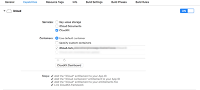
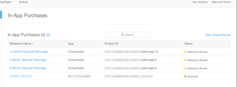

# PatronKit
A framework to add patronage to your apps.

Patronage is a model where everything in your app is free, but users can donate and become "patrons."

PatronKit uses CloudKit to record purchases, and then display tallies back to the user. It also shows the user when their patronage expires. This encourages users to donate frequently, hopefully rewarding you for your work.

Requirements:
---

PatronKit was written with Swift 2 in Xcode 7.2. You can run it on iOS 8.0 or later. If you need to support iOS 7, use the raw Swift files instead of the framework.

Setting it Up:
---

There are five steps to use PatronKit:

1. Include the framework in your project
2. Configure your project to use CloudKit
3. Configure In-App Purchases
4. Tell PatronKit about your In-App Purchase identifiers
5. Present an instance of `PatronageViewController`

**Step 1:** Including PatronKit in your project.

PatronKit is a dynamic framework, so you should drag the Xcode project into your own, and link against it. PatronKit is written in Swift, so `@import PatronKit` is all you need to access it. 

If you run into issues with XCTest, please double check that Xcode isn't compiling the PatronKit Swift files as part of your apps target. PatronKit doesn't support CocoaPods at this time.

**Step 2:** Configuring CloudKit 

To set up CloudKit, open the Capabilities tab in Xcode and enable CloudKit. PatronKit uses the default container and record zone for storing patronage data, so you should only need to flip the switch.

**Step 3:** Configuring In-App Purchases

You should create a few in-app purchase products with the "consumable" type. The identifiers should be a reverse-domain style identifier ending with a number. This number is the length of the patronage offered by the product, in months. For example, `com.mosheberman.patronapp.3` offers three months of patronage.

**Step 4:** Tell PatronKit about your in-app purchases, by passing it an NSSet with the product identifiers, like so:

    NSSet *identifiers = [NSSet setWithArray:@[@"com.mosheberman.patronapp.3", @"com.mosheberman.patronapp.6", @"com.mosheberman.patronapp.12"]];
    [[PatronManager sharedManager] setProductIdentifiers:identifiers];

At this point, you're all set up. Now, we just need to show our users the patronage options.

**Step 5:** Showing a `PatronageViewController`

`PatronageViewController` subclasses `UITableViewController`, so you can present it as you wish. (For example, present it modally, or puh it onto a UINavigationController stack. If you present it modally, you'll have to provide your own dismissal method.)

Features:
---

- Offer patronage purchases to your users
- Track when users patronage expires
- Encourage users to donate by showing them how many other users did 
- Encourage users to rate your app by showing them how many other reviews there are for the current app version. (You have to implement the UI for this by yourself, but fetching the number is built in to `PatronManager`)

Thanks:
---

Marco Arment for providing the inspiration for this framework, as well as some guidence in the initial ioplementation.

License:
---

MIT. Please feel free to let me know if you've used this in your app and how it works for you.

