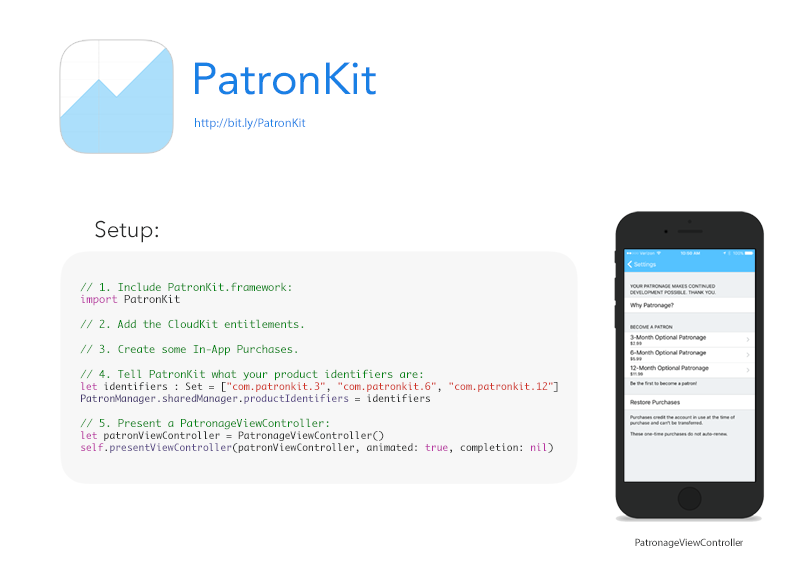
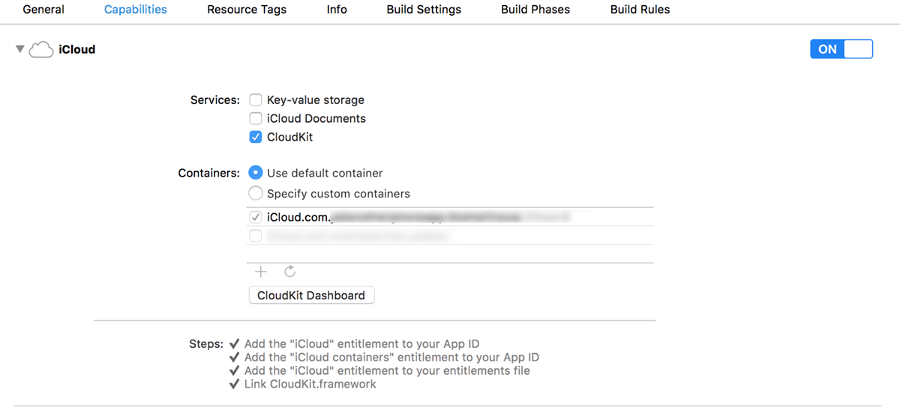
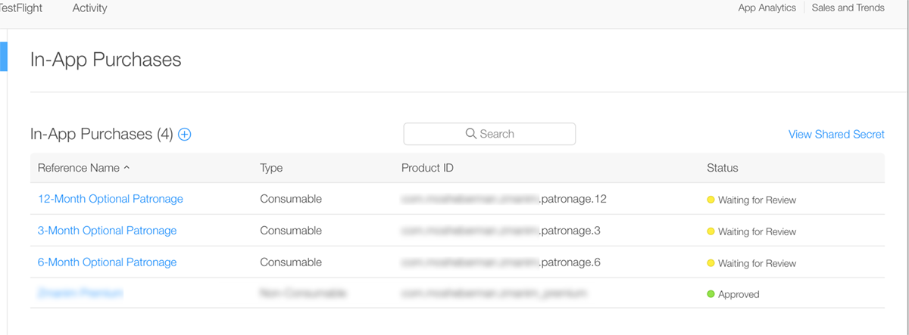

[](./demo/Promo.png)

# PatronKit
A framework for add a patronage area to your apps.

PatronKit uses CloudKit to record purchases, and then display tallies back to the user. It also shows the user when their patronage expires. This encourages users to donate frequently, hopefully rewarding you for your work.

Features:
---

- Offer patronage purchases to your users in a pre-built UI (This UI is going to change in a near-future release.)
- Track when a users patronage expires
- Showing how many users already donated
- Show how many reviews there are for the current app version. (You have to implement the UI for this by yourself, but fetching the number is built in to `PatronManager`)


Requirements:
---

PatronKit was written with Swift 2 in Xcode 7.2. You can run it on iOS 8.0 or later. If you need to support iOS 7, use the raw Swift files (and storyboard) instead of the framework.

Installation & Usage:
---

There are five steps to use PatronKit:

1. Include the framework in your project
2. Configure your project to use CloudKit
3. Configure In-App Purchases
4. Tell PatronKit about your In-App Purchase identifiers
5. Present an instance of `PatronageViewController`

**Step 1:** Including PatronKit in Your Project

PatronKit is a dynamic framework, so you should drag the Xcode project into your own, and link against it. PatronKit doesn't support CocoaPods at this time. The usual disclaimers about Swift Package Manager being a work in progress apply. 

PatronKit is written in Swift, so an import is all you need to access it. You can use it in both Swift and Objective-C projects.

*Swift:*
```swift
import PatronKit
```
    
*Objective-C:*
```objc
@import PatronKit;
```

*Note:* If you run into issues with XCTest, please double check that Xcode isn't compiling the PatronKit Swift files as part of your app target. 

**Step 2:** Configuring CloudKit 

To set up CloudKit, open the Capabilities tab in Xcode and enable CloudKit. PatronKit uses the default container and record zone for storing patronage data, so you should only need to flip the switch.



**Step 3:** Configuring In-App Purchases

You should create a few in-app purchase products with the "consumable" type. The identifiers should be a reverse-domain style identifier ending with a number. This number is the length of the patronage offered by the product, in months. For example, `com.mosheberman.patronapp.3` offers three months of patronage.



**Step 4:** Tell PatronKit about your In-App Purchases.

You do this by passing the `PatronManager` an NSSet with your product identifiers, like so:

*Swift:*
```swift
let identifiers: Set = Set(arrayLiteral: ["com.patronkit.3", "com.patronkit.6", "com.patronkit.12"])
PatronManager.sharedManager.productIdentifiers = identifiers
```

*Objective-C:*
```objc
NSSet *identifiers = [NSSet setWithArray:@[@"com.patronkit.3", @"com.patronkit.6", @"com.patronkit.12"]];
[[PatronManager sharedManager] setProductIdentifiers:identifiers;
```
At this point, you're all set up. PatronKit will sort the identifiers for you when it displays the products, from smallest number of months to largest. Now, we just need to show our users the patronage options.

**Step 5:** Showing a Patronage View Controller

`PatronageViewController` subclasses `UITableViewController`, so you can present it as you wish. (For example, present it modally, or puh it onto a UINavigationController stack. If you present it modally, you'll have to provide your own dismissal method.)

Getting App Review Counts:
----
Optionally, you can get the number of reviews of your app on the App Store by passing your Apple app ID to PatronManager, by setting the appID property:

*Swift:*
```swift
PatronManager.sharedManager.appID = "xxxxxx"
```    
*Objective-C:*
```objc
PatronManager.sharedManager.appID = @"xxxxxx"
```
To Do:
---
- [ ] Clever things to make the patron count look good
- [ ] Show the review count somewhere

What is Patronage?
---
If you've read this far, you probably already want to try patronage in your app. 

Patronage is a model where everything in your app is free, but users can donate and become "patrons." For a really good explanation, download [Overcast](https://itunes.apple.com/us/app/overcast-podcast-player/id888422857?mt=8), and look at Marco's reasoning. 

Thanks:
---

Marco Arment for providing the inspiration for this framework, as well as some guidence in the initial implementation.


License:
---

MIT. Please feel free to let me know if you've used this in your app and how it works for you.


[](https://bitdeli.com/free "Bitdeli Badge")

